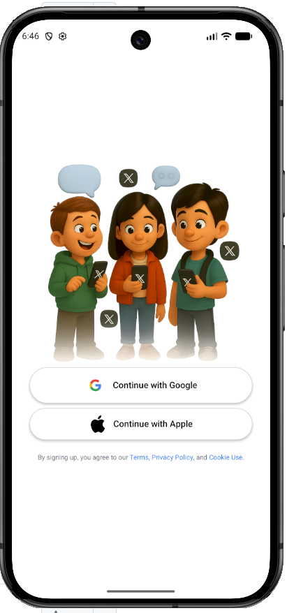
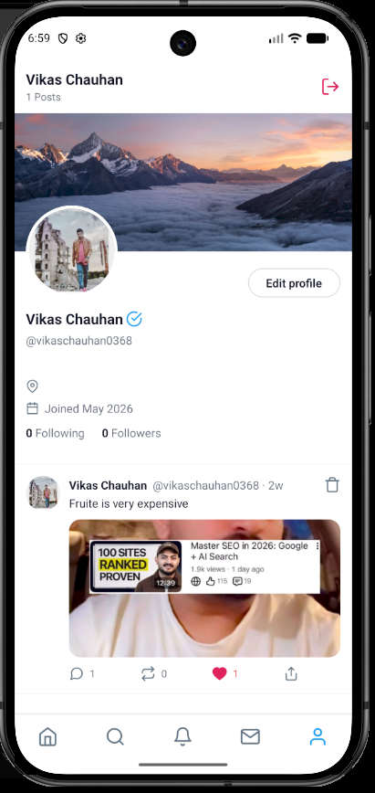

# 🚀 XClone - Full Stack Social Media App

A modern full-stack social media mobile application built with **React Native (Expo)**, **Express.js**, **MongoDB**, **Clerk Authentication**, and **Cloudinary**.

---

# 📱 App Features Overview

- 🔐 Authentication via Clerk (Google / Apple ID supported)
- 🏠 Home Screen to post text & images (from gallery or camera)
- ❤️ Like & Comment system with smooth modal interactions
- 🔔 Notifications Tab for likes & comments
- 💬 Messages Tab with chat history & long press delete
- 👤 Profile Tab with editable profile modal
- 🔎 Search Tab for trending content
- 🚪 Sign Out that returns to login screen

---

# 🧠 What You'll Learn

- ⚡ Build a REST API with Express.js & MongoDB
- 🔐 Implement robust auth with Clerk
- ☁️ Upload & serve images via Cloudinary
- 🛡️ Add rate-limiting, bot detection & security with Arcjet
- 🌿 Use Git & GitHub in real-world workflow
- 🚀 Connect everything in a real deployment setup

---

# 🛠️ Tech Stack

## Frontend (Mobile)

- React Native
- Expo SDK 54
- Expo Router
- TypeScript
- React Query
- NativeWind / Tailwind CSS
- Clerk Expo
- Axios

## Backend

- Node.js
- Express.js
- MongoDB + Mongoose
- Clerk Express
- Cloudinary
- Multer
- Arcjet
- Vercel Deployment

---

# 📂 Project Structure

```bash
XClone/
│
├── backend/
│   ├── src/
│   ├── routes/
│   ├── controllers/
│   ├── middleware/
│   └── config/
│
├── mobile/
│   ├── app/
│   ├── components/
│   ├── hooks/
│   ├── utils/
│   └── assets/
```

---

# 📸 App Screenshots






